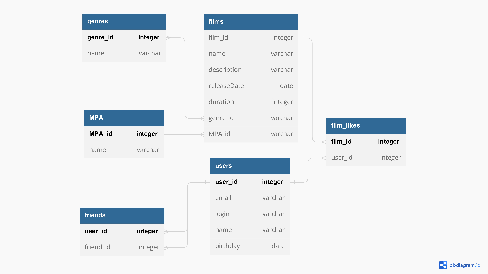

# java-filmorate



### Примеры запросов для основных операций приложения:

#### Получение логина пользователя по id

```sql
SELECT login
FROM users
WHERE user_id = 1;
```

#### Получение описания фильма по id

```sql
SELECT description
FROM films
WHERE film_id = 1;
```

#### Получение количества друзей пользователя по id

```sql
SELECT COUNT(friend_id)
FROM friends 
WHERE user_id = 1;
```
=======

